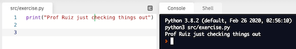

# GitHub Orientation Assignment


## Objectives
- Become familiar with completing your programming assignments via GitHub.
- Experience how a rubric will be used to grade your programming assignments.

## Important Note
All coding **must** be done inside of the repl.it IDE that is created when you click the **work in repl.it** button above. 
- Do not create/edit/update/complete your program anywhere else.
- Do not copy and paste code from anywhere else.
- The record of your iterative development process created in that repl.it IDE is proof that you did not plagiarize your work. 

## Directions
1. Design a program that:
    - Includes a comment indicating this is the GitHub Orientation Assignment.
    - Displays your full name to the console.
    - Calculates and displays the number of items in eight dozen
    - Calculates and displays the number of weeks in 180 days, as a whole number (truncated)   
2. Test your program by running it and examining the output. Fix any errors that occur. Your output should match the example below exactly, with the exception of your name:

    ```console
    Jane Doe
    96
    25
    ```

## GitHub Submission
This [video](https://youtu.be/gdc-SYhRFCM) will walk you through the GitHub submission process step-by-step. 

## Python Reference
This [website](https://cs-1400.github.io/) can be used as a quick Python reference as you complete these GitHub programming assignments.

## Replit Run Button 
Occasionally, the Repl.it run button will not work. If this happens to you, manually run your file by typing `python3 src/exercise.py` at the prompt in the console:


